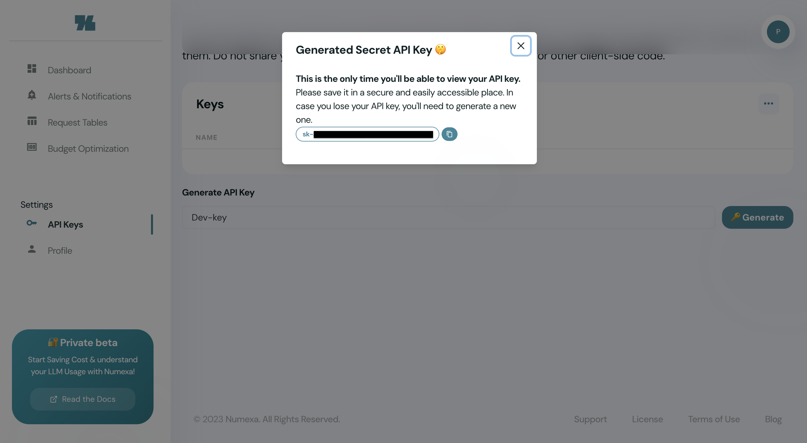

# Set Up Numexa

Unlock the Full Potential: Get Started with Your Numexa Account

#### Step-1: Setting up your account on Numexa is a breeze:

1. Visit cloud.numexa.io
2. Click on "Sign Up"
3. Follow the sign-up flow to create your account

#### Step-2: Once your account is up and running, you can immediately start utilizing Numexa's capabilities by generating your API key:

